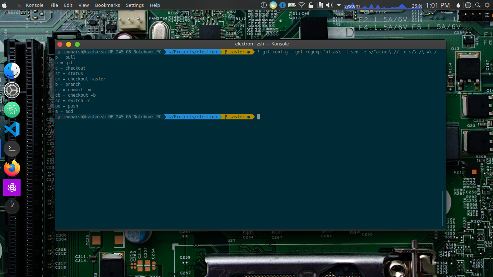

# What is git ?
In simple words Git is a distributed version-control system for tracking changes in source code during software development. It is designed for coordinating work among programmers, but it can be used to track changes in any set of files.

You can create short commands for your usual git commands using git aliases. We all become bore of typing the same long boring git command for hundred times a day. So to get rid of this boring practise i came across git aliases.

## SHOW ME HOW

To set up a new alias for a command, we gonna be using the ```git config``` command.

**Some of the alias i personally use:**

```
git config --global alias.b branch
git config --global alias.c checkout
git config --global alias.c checkout
git config --global alias.cm 'checkout master'
git config --global alias.cb 'checkout -b'
git config --global alias.st status
git config --global alias.ci 'commit -m'
git config --global alias.p pull
git config --global alias.pu push
git config --global alias.a 'add .'
```

The aliases listed above are used by me and you can also use them and can add as many as you want, and however you want.

## But how can i create one ?
Just type the following command into your terminal and don't forget to replace [insertYourShortcut]  and [gitCommand] with your command and shortcut.
```
git config --global alias.[insertYourShortcut] [gitCommand]
```

## How to use these aliases ?
You just have to type ```git [aliasShortcutName]```.

Lets say you wanna pull the repo from the origin just type ```git p``` and ```git pu``` to push the changes to master based on the alias we have created.

### PRO-TIP
Type this to show all of the aliases you have created:
```
! git config --get-regexp ^alias\. | sed -e s/^alias\.// -e s/\ /\ =\ /
```


I hope this article helped you. Please do give your valuable feedback on this article. Bye! Bye! I will catch you in my next article.